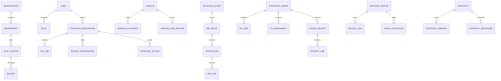

# Architecture & Design Blueprint — ProcureSphere 360

PRD Reference: HPE-PRD-2026-PROC01 / VER-1.0-DRAFT  
Issuing Authority: HPE Team  
Development Partner: VPD Technologies Pvt. Ltd.

---

## 1. System Architecture Overview

ProcureSphere 360 is built as an enterprise-grade Django 4.2+ monolithic backend with clean domain app isolation, RESTful API capabilities (DRF 3.14+), Redis-backed Celery worker/beat async task execution, and PostgreSQL 15+ transactional persistence.

```
                  ┌──────────────────────────────────────────────┐
                  │          Client / Browser / API User         │
                  └──────────────────────┬───────────────────────┘
                                         │ HTTPS / TLS
                                         ▼
                  ┌──────────────────────────────────────────────┐
                  │                 Nginx Proxy                  │
                  └──────────────────────┬───────────────────────┘
                                         │ WSGI / HTTP
                                         ▼
                  ┌──────────────────────────────────────────────┐
                  │             Gunicorn / Django App            │
                  │   (REST APIs + HTMX UI + Domain Services)    │
                  └──────────────┬────────────────┬──────────────┘
                                 │                │
                PostgreSQL SQL   │                │ Redis Async / Queue
                                 ▼                ▼
                  ┌──────────────────┐    ┌──────────────────┐
                  │ PostgreSQL 15+ DB│    │  Redis 7+ Broker │
                  └──────────────────┘    └────────┬─────────┘
                                                   │
                                                   ▼
                                          ┌──────────────────┐
                                          │ Celery Worker /  │
                                          │ Celery Beat      │
                                          └──────────────────┘
```

---

## 2. Directory Layout & Layer Boundaries

```
ProcureSphere_360/
├── src/
│   ├── apps/
│   │   ├── core/           # Base models, state machines, audit helpers, request-ID middleware
│   │   ├── accounts/       # User, Role, Permission, JWT, login throttling
│   │   ├── organization/   # Legal entities, Departments, CostCenters, Approval limits
│   │   ├── approvals/      # Approval Policy Engine, Steps, Routing, Actions
│   │   ├── vendors/        # Vendor registration, KYC, Risk, Governance
│   │   ├── requisitions/   # PR lines, attachments, budget validation integration
│   │   ├── sourcing/       # RFQ/RFP events, Invitations, Sealed Bids, Evaluations, Awards
│   │   ├── orders/         # Purchase Orders, Versioning/Amendments, Delivery Schedules
│   │   ├── receipts/       # Goods Receipt Notes, Inspection, Rejections
│   │   ├── invoices/       # Invoices, 3-Way Match Engine, Exception Resolution
│   │   ├── contracts/      # Contract master, Versions, Obligations, Milestones, Alerts
│   │   ├── budgets/        # Budget allocations, BudgetReservations, SpendLedger
│   │   ├── scorecards/     # Vendor performance scoring algorithms
│   │   ├── notifications/  # In-app alerts, email dispatch via Celery
│   │   ├── reports/        # Analytics, 9 mandatory report query selectors
│   │   └── audit/          # Append-only AuditLog model & Export jobs
│   └── config/
│       ├── settings/       # base.py, dev.py, staging.py, prod.py
│       ├── urls.py
│       ├── wsgi.py
│       ├── asgi.py
│       └── celery.py
```

---

## 3. Data Model Blueprint (Core Entities & FK Topology)



---

## 4. Key Execution Patterns & Domain Rules

1. **Service Layer Isolation**: Views and Serializers must invoke functions in `services.py` inside `transaction.atomic()`. No direct mutation of state or workflow status in view bodies.
2. **State Machine Guards**: Every state transition uses a centralized state machine validator in `core/services.py` that verifies allowed `(from_state -> to_state)` pairs, user role permissions, and creates an append-only `AuditLog` entry.
3. **Budget Ledger Lifecycle**:
   - PR Approved -> `BudgetReservation` created (`RESERVED`).
   - PO Issued -> `SpendLedger` created (`COMMITMENT`).
   - Invoice Approved -> `SpendLedger` updated (`ACTUAL`).
4. **Sealed Bid Privacy**: Querysets in `sourcing/selectors.py` filter out vendor bid contents when `event.status == BID_WINDOW` for non-owner vendor users and internal evaluators until bid window close.
